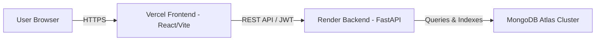

# HealthGuard AI — Production Deployment Guide

This guide outlines the complete step-by-step process for deploying **HealthGuard AI**:
- **Backend**: FastAPI + Python ML Risk Engine on **[Render](https://render.com)**
- **Database**: Free Managed MongoDB on **[MongoDB Atlas](https://www.mongodb.com/atlas)**
- **Frontend**: React + Vite SPA on **[Vercel](https://vercel.com)**

---

## 🏗️ Architecture Overview



---

## Step 1: Set Up MongoDB Atlas (Database)

1. Go to [MongoDB Atlas](https://www.mongodb.com/cloud/atlas/register) and create a free account.
2. Create a new **Free Shared Cluster** (e.g. `M0 Sandbox`).
3. Under **Security → Database Access**:
   - Create a database user (e.g., username: `healthguard_admin`, password: `your_secure_password`).
4. Under **Security → Network Access**:
   - Click **Add IP Address** → choose **Allow Access from Anywhere (`0.0.0.0/0`)** so Render can connect.
5. Under **Deployment → Database → Connect**:
   - Choose **Drivers (Python)**.
   - Copy your connection string:
     ```text
     mongodb+srv://healthguard_admin:<password>@cluster0.xxxxx.mongodb.net/?retryWrites=true&w=majority
     ```

---

## Step 2: Deploy Backend on Render

### Option A: Using the Included Blueprint (`render.yaml`) — Recommended
1. Push your repository to **GitHub** or **GitLab**.
2. Log into [Render Dashboard](https://dashboard.render.com/).
3. Click **New +** → **Blueprint**.
4. Select your **HealthGuard AI** repository.
5. Render will automatically detect `render.yaml` and configure:
   - **Root Directory**: `backend`
   - **Build Command**: `pip install --upgrade pip && pip install -r requirements.txt`
   - **Start Command**: `uvicorn app.main:app --host 0.0.0.0 --port $PORT`
6. Fill in the required environment variable:
   - `MONGODB_URI`: Paste your MongoDB Atlas connection string from Step 1.
7. Click **Apply**.

### Option B: Manual Web Service Setup
1. On Render, click **New +** → **Web Service**.
2. Connect your GitHub repository.
3. Configure the settings:
   - **Name**: `healthguard-ai-backend`
   - **Region**: Choose the closest region (e.g. Oregon, Frankfurt)
   - **Root Directory**: `backend`
   - **Runtime**: `Python 3`
   - **Build Command**: `pip install --upgrade pip && pip install -r requirements.txt`
   - **Start Command**: `uvicorn app.main:app --host 0.0.0.0 --port $PORT`
   - **Plan**: `Free`
4. Under **Environment Variables**, add:
   | Key | Value | Description |
   |---|---|---|
   | `PYTHON_VERSION` | `3.11.9` | Recommended Python runtime |
   | `DEBUG` | `false` | Production mode |
   | `HOST` | `0.0.0.0` | Bind to all interfaces |
   | `MONGODB_URI` | `mongodb+srv://...` | Your MongoDB Atlas connection URI |
   | `DATABASE_NAME` | `healthguard` | Default database name |
   | `JWT_SECRET_KEY` | *(generate a random 64-char string)* | JWT Token signing key |
   | `COOKIE_SECURE` | `true` | Secure HTTPS cookies in production |
   | `ADMIN_USERNAME` | `admin` | Admin dashboard username |
   | `ADMIN_PASSWORD` | `your_secure_admin_password` | Admin dashboard password |
   | `CORS_ORIGINS` | `["http://localhost:5173","https://*.vercel.app"]` | Allowed origins |

5. Click **Create Web Service**.
6. Once deployed, copy your Render service URL (e.g. `https://healthguard-ai-backend.onrender.com`).

---

## Step 3: Deploy Frontend on Vercel

1. Log into [Vercel Dashboard](https://vercel.com/dashboard).
2. Click **Add New...** → **Project**.
3. Import your **HealthGuard AI** GitHub repository.
4. In the Project Configuration:
   - **Framework Preset**: `Vite`
   - **Root Directory**: Click *Edit* and select **`frontend`**.
   - **Build Command**: `npm run build` *(default)*
   - **Output Directory**: `dist` *(default)*
5. Under **Environment Variables**, add:
   | Key | Value |
   |---|---|
   | `VITE_API_URL` | `https://<your-render-backend-url>.onrender.com/api` |
   | `VITE_API_BASE_URL` | `https://<your-render-backend-url>.onrender.com/api` |
   | `VITE_GOOGLE_CLIENT_ID` | `159291729588-m8kj341c0i9bk3oqikl3vf6b1lam1llf.apps.googleusercontent.com` |

   *(Note: Remember to append `/api` to your Render backend URL)*

6. Click **Deploy**.
7. Vercel will build and deploy your frontend in seconds (e.g. `https://health-guard-ai.vercel.app`).

---

## Step 4: Add Authorized JavaScript Origins to Google Cloud (Optional)

If using **Google Sign-In**:
1. Go to [Google Cloud Console → Credentials](https://console.cloud.google.com/apis/credentials).
2. Open your OAuth 2.0 Client ID.
3. Under **Authorized JavaScript origins**, add:
   - Your Vercel production URL: `https://<your-app>.vercel.app`
4. Under **Authorized redirect URIs**, add:
   - `https://<your-app>.vercel.app`
5. Click **Save**.

---

## ✅ Deployment Checklist

- [x] `vercel.json` routing configuration added to prevent 404 on page refresh.
- [x] CORS configuration in backend configured for wildcard `https://*.vercel.app`.
- [x] Render Blueprint `render.yaml` configured with health check `/api/health`.
- [x] Frontend build tested and passing (`npm run build`).
