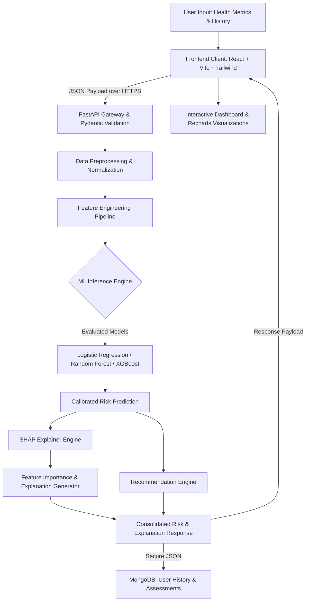
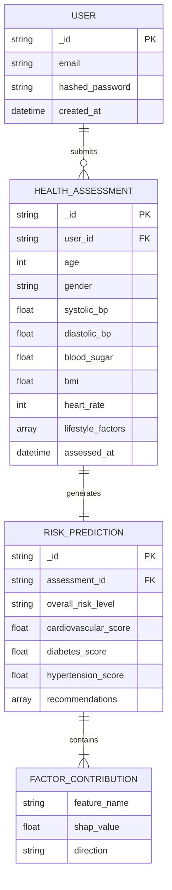

# HealthGuard AI

### AI-Powered Early Health Risk Assessment & Decision Support System

[](#development-roadmap)
[](https://www.python.org/)
[](https://fastapi.tiangolo.com/)
[-61DAFB?logo=react&logoColor=black)](https://react.dev/)
[](https://tailwindcss.com/)
[](#license)

---

> [!WARNING]
> ## ⚠️ Critical Medical Disclaimer
> **HealthGuard AI is strictly an educational and decision-support technology project designed for early health risk assessment.**
> 
> It does **NOT**:
> * Provide medical diagnoses or clinical evaluations.
> * Replace certified healthcare professionals, physicians, or clinical triage.
> * Prescribe medication, treatments, or medical interventions.
> * Provide emergency medical care or acute monitoring.
> * Guarantee clinical outcomes or diagnostic accuracy.
>
> **Always consult a qualified healthcare professional** for medical advice, formal diagnosis, or individualized treatment plans. If you or someone you know is experiencing acute, severe, or emergency symptoms, immediately contact your local emergency medical services.

---

## 📌 Table of Contents

- [Executive Overview](#-executive-overview)
- [Core Value Proposition](#-core-value-proposition)
- [Key Features](#-key-features)
- [System Architecture & ML Pipeline](#-system-architecture--ml-pipeline)
- [Explainable AI (SHAP Integration)](#-explainable-ai-shap-integration)
- [Model Evaluation Strategy](#-model-evaluation-strategy)
- [Technology Stack](#-technology-stack)
- [Planned Project Structure](#-planned-project-structure)
- [Planned Data Models & Database](#-planned-data-models--database)
- [Planned REST API Specification](#-planned-rest-api-specification)
- [Installation & Local Setup (Windows / PowerShell)](#-installation--local-setup-windows--powershell)
- [Environment Configuration](#-environment-configuration)
- [Data Privacy & Ethical AI](#-data-privacy--ethical-ai)
- [Interface & Screenshots](#-interface--screenshots)
- [Development Roadmap](#-development-roadmap)
- [Contributing](#-contributing)
- [License](#-license)

---

## 📖 Executive Overview

**HealthGuard AI** is a modern, full-stack predictive health decision-support platform. It utilizes machine learning algorithms and Explainable AI (XAI) to analyze non-invasive baseline physiological indicators, lifestyle habits, and hereditary metrics to evaluate early risk markers for chronic conditions.

Rather than acting as a black-box scoring system, HealthGuard AI pairs **probabilistic risk assessments** with **SHAP (SHapley Additive exPlanations)** to provide transparent, interpretable factor attribution. This equips users with an understanding of *why* a particular risk level was estimated and offers personalized wellness and lifestyle recommendations to discuss with their physician.

```
       +-----------------------------------------------------------------+
       |                         HealthGuard AI                          |
       |  Early Risk Assessment  •  Explainable AI  •  Actionable Insights |
       +-----------------------------------------------------------------+
```

---

## 🎯 Core Value Proposition

| Dimension | Traditional Black-Box Systems | HealthGuard AI Approach |
| :--- | :--- | :--- |
| **Risk Attribution** | Single opaque percentage or label | Granular SHAP feature importance breakdown |
| **Decision Support** | Binary classification without context | Multi-condition stratified risk levels (Low, Moderate, High) |
| **User Actionability** | Generic, non-contextual advice | Personalized lifestyle suggestions with tracking recommendations |
| **Clinical Boundary** | Often blurs lines with diagnostic claims | Explicit educational decision support and physician consultation prompts |

---

## 🌟 Key Features

> *Note: Feature statuses reflect current project progress (Planned / In Development / Implemented).*

- 🩺 **Multi-Parameter Health Assessment** *(Planned)*  
  Structured capture of baseline physiological markers: Age, Gender, Blood Pressure (Systolic/Diastolic), Blood Glucose, BMI, Resting Heart Rate, lifestyle indicators, and family history.

- 🤖 **Predictive Machine Learning Engine** *(Planned)*  
  Comparative multi-model pipeline evaluating **Logistic Regression**, **Random Forest**, and **XGBoost** to determine stratified risk levels (*Low*, *Moderate*, *High*) across multiple chronic vectors:
  - Heart Disease Risk
  - Type-2 Diabetes Risk

- 🔍 **Explainable AI (XAI) with SHAP** *(Planned)*  
  Deconstructs predictions at the individual assessment level, identifying exact contributing factors (e.g., elevated BMI or systolic pressure) to eliminate black-box opacity.

- 📊 **Interactive Health Dashboard** *(Planned)*  
  Data visualization interface displaying composite risk scores, physiological indicator gauges, risk factor breakdowns, and AI-driven summary insights.

- 📈 **Longitudinal Trend Tracking** *(Planned)*  
  Historical assessment comparisons to monitor physiological progress over time across periodic lifestyle interventions.

- 💡 **Personalized Wellness Recommendations** *(Planned)*  
  Rule-assisted, AI-synthesized lifestyle modifications, dietary awareness points, monitoring intervals, and physician discussion prompts.

- 🔐 **Secure Access & Authentication** *(Planned)*  
  JWT-based session authentication with bcrypt password hashing and strict input validation via Pydantic schemas.

---

## 🏗️ System Architecture & ML Pipeline

HealthGuard AI follows a decoupled microservice-ready architecture comprising a **React (Vite) single-page application**, a **FastAPI asynchronous backend**, and a dedicated **Machine Learning & Inference Pipeline**.

### End-to-End Processing Workflow



### ML Pipeline Stages

1. **Input Validation**: Rigorous boundary checking and sanitization via Pydantic models (e.g., physiological thresholds for BP, BMI, and Glucose).
2. **Preprocessing**: Handling missing values, categorical encoding (One-Hot / Ordinal), and feature scaling (StandardScaler / RobustScaler).
3. **Feature Engineering**: Deriving clinically relevant interaction terms (e.g., Pulse Pressure = Systolic - Diastolic, BMI categorizations).
4. **Model Inference**: Executing the best-performing model selected through cross-validation.
5. **Explainability Layer**: Generating local SHAP values to quantify positive and negative contributions of each input feature.
6. **Recommendation Synthesis**: Mapping risk scores and primary contributing factors into actionable lifestyle and monitoring suggestions.

---

## 🔍 Explainable AI (SHAP Integration)

In healthcare decision support, **interpretability is a foundational safety requirement**. Standard machine learning models often act as black boxes, outputting risk scores without rationale. HealthGuard AI incorporates **SHAP (SHapley Additive exPlanations)** based on cooperative game theory to quantify the exact contribution of each clinical feature to the final prediction.

### Interpretability Paradigm

```
┌─────────────────────────────────────────────────────────────────────────┐
│                           Standard ML Output                            │
│  "Cardiovascular Risk: High (82%)"                                      │
│  [No reasoning provided]                                                │
├─────────────────────────────────────────────────────────────────────────┤
│                     HealthGuard AI + SHAP Output                        │
│  "Cardiovascular Risk: High (82%)"                                      │
│                                                                         │
│  Top Contributing Factors:                                              │
│  ▲ Systolic Blood Pressure (148 mmHg)  --> +0.31 to risk score          │
│  ▲ BMI (31.4 kg/m²)                   --> +0.24 to risk score          │
│  ▲ Fasting Blood Sugar (126 mg/dL)     --> +0.18 to risk score          │
│  ▼ Physical Activity (4 days/wk)       --> -0.09 to risk score          │
│                                                                         │
│  Generated Summary:                                                     │
│  "Elevated systolic blood pressure and BMI were the strongest factors   │
│   elevating the calculated cardiovascular risk profile."                │
└─────────────────────────────────────────────────────────────────────────┘
```

> [!NOTE]
> All SHAP-derived explanations represent statistical model associations within the training distribution and are **not** clinical causal determinations.

---

## 📐 Model Evaluation Strategy

Model selection in HealthGuard AI is strictly governed by rigorous evaluation on representative datasets, prioritizing clinically aligned sensitivity over naive accuracy.

### Candidate Algorithms Under Evaluation

| Algorithm | Strengths | Trade-offs | Role in Pipeline |
| :--- | :--- | :--- | :--- |
| **Logistic Regression** | Highly interpretable, linear baseline, fast inference | Limited capacity for non-linear interactions | Baseline Benchmark |
| **Random Forest** | Robust against overfitting, handles non-linear relationships | Larger memory footprint, complex trees | Non-linear Candidate |
| **XGBoost** | High predictive performance, gradient boosting optimization | Requires careful hyperparameter tuning | Primary Ensemble Candidate |

### Evaluation Metrics Framework

* **ROC-AUC (Receiver Operating Characteristic - Area Under Curve)**: Primary ranking metric across continuous decision thresholds.
* **Recall / Sensitivity**: Prioritized to minimize False Negatives (critical in early risk screening).
* **Precision & F1-Score**: Evaluated to maintain balance and prevent alert fatigue.
* **Confusion Matrix Analysis**: Strict audit of error distributions across risk classes.
* **Brier Score / Calibration Curves**: Ensures output probabilities reflect true empirical risk.

---

## 💻 Technology Stack

| Layer | Technology | Purpose | Implementation Status |
| :--- | :--- | :--- | :--- |
| **Frontend Framework** | React 18+ (Vite) | Single-Page Application client | *Planned* |
| **Styling & UI** | Tailwind CSS | Modern responsive design system | *Planned* |
| **Data Visualization** | Recharts / Chart.js | Interactive risk gauges and trend tracking | *Planned* |
| **Backend Framework** | FastAPI (Python 3.10+) | High-performance asynchronous REST API | *Planned* |
| **Schema Validation** | Pydantic v2 | Data validation and serialization | *Planned* |
| **ASGI Web Server** | Uvicorn | High-concurrency async server | *Planned* |
| **ML & Data Processing** | Scikit-learn, Pandas, NumPy | Pipeline preprocessing, baseline models | *Planned* |
| **Ensemble Modeling** | XGBoost | High-performance gradient boosted decision trees | *Planned* |
| **Explainability (XAI)** | SHAP (Kernel/TreeExplainer) | Feature attribution & explainability | *Planned* |
| **Database** | MongoDB / MongoDB Atlas | Document storage for assessments and history | *Planned* |
| **Authentication** | PyJWT, Passlib (bcrypt) | Token-based auth and credential security | *Planned* |
| **Deployment / Hosting** | Vercel (Frontend), Render (Backend) | Cloud CI/CD and deployment targets | *Planned* |

---

## 📂 Planned Project Structure

The project will follow a modular, clean-architecture directory layout separating frontend interface, backend API routing, machine learning pipelines, and documentation:

```
healthguard-ai/
│
├── frontend/                          # React + Vite Client Application
│   ├── public/                        # Static web assets and icons
│   ├── src/
│   │   ├── assets/                    # UI images, logos, and graphics
│   │   ├── components/                # Reusable UI components (Navbar, Cards, Gauges)
│   │   │   ├── common/                # Buttons, Modals, Inputs, Alerts
│   │   │   ├── dashboard/             # RiskScoreCard, FactorBreakdown, TrendChart
│   │   │   └── forms/                 # HealthAssessmentForm, MetricInputs
│   │   ├── context/                   # React Context (Auth, HealthState)
│   │   ├── hooks/                     # Custom React hooks (useAuth, useAssessment)
│   │   ├── pages/                     # Routed views (Home, Assessment, Dashboard, History)
│   │   ├── services/                  # API client services (axios / fetch wrapper)
│   │   ├── styles/                    # Global Tailwind CSS configurations
│   │   ├── App.jsx                    # Root component with router
│   │   └── main.jsx                   # React application entry point
│   ├── index.html
│   ├── package.json
│   ├── tailwind.config.js
│   └── vite.config.js
│
├── backend/                           # FastAPI Application Core
│   ├── app/
│   │   ├── api/                       # API Route Controllers
│   │   │   ├── v1/
│   │   │   │   ├── auth.py            # Login, registration, token refresh
│   │   │   │   ├── assessment.py      # Health evaluation submission & retrieval
│   │   │   │   ├── history.py         # Longitudinal user assessments
│   │   │   │   └── router.py          # Central v1 route aggregator
│   │   ├── core/                      # Application Configurations
│   │   │   ├── config.py              # Environment variables and app settings
│   │   │   ├── database.py            # MongoDB connection manager (Motor/PyMongo)
│   │   │   └── security.py            # Password hashing, JWT token creation
│   │   ├── models/                    # Pydantic Schemas & MongoDB Entities
│   │   │   ├── user.py                # User account models
│   │   │   ├── assessment.py          # Input metrics & health submission schemas
│   │   │   └── prediction.py          # Risk output, SHAP breakdown & recommendations
│   │   ├── services/                  # Business Logic Layer
│   │   │   ├── ml_service.py          # Model inference and artifact loading
│   │   │   ├── shap_service.py        # SHAP calculation & factor attribution
│   │   │   └── recommendation.py      # Personalized suggestions engine
│   │   └── main.py                    # FastAPI application instance & middleware
│   ├── requirements.txt
│   └── .env.example
│
├── ml/                                # Machine Learning Research & Pipeline
│   ├── datasets/                      # Anonymized training data (git-ignored raw data)
│   │   └── sample_schema.json         # Reference schema for dataset structure
│   ├── notebooks/                     # Jupyter notebooks for EDA and experimentation
│   │   ├── 01_exploratory_analysis.ipynb
│   │   ├── 02_model_training.ipynb
│   │   └── 03_shap_explainability.ipynb
│   ├── preprocessing/                 # Data cleaning and feature transformers
│   │   └── pipeline.py
│   ├── training/                      # Training scripts for model evaluation
│   │   ├── train_classifier.py
│   │   └── evaluate_metrics.py
│   ├── artifacts/                     # Serialized production models (.pkl / .joblib)
│   └── explainability/                # SHAP summary visualizers and explainer dumps
│
├── docs/                              # Project Architecture & API Documentation
│   ├── ARCHITECTURE.md
│   └── API_SPEC.md
│
├── .gitignore                         # Git exclusion rules
├── README.md                          # Project documentation
└── LICENSE                            # Software license
```

---

## 🗄️ Planned Data Models & Database

HealthGuard AI plans to use **MongoDB** (via async Motor or PyMongo) for non-blocking document storage of dynamic assessment logs and user metrics.

### Key Data Entities



---

## 🔌 Planned REST API Specification

Below is the design specification for the backend REST endpoints to be implemented in FastAPI:

### 1. Health Assessment & Prediction

* **Endpoint**: `POST /api/v1/assessment/predict`
* **Purpose**: Submits patient health metrics, executes ML inference, computes SHAP values, and returns risk analysis.
* **Request Header**: `Authorization: Bearer <JWT_TOKEN>`

#### Request Payload Example
```json
{
  "age": 48,
  "gender": "male",
  "systolic_bp": 142,
  "diastolic_bp": 90,
  "blood_sugar": 128.5,
  "bmi": 29.4,
  "heart_rate": 78,
  "smoking_status": "former",
  "physical_activity_hours_weekly": 1.5,
  "family_history_diabetes": true,
  "family_history_hypertension": true
}
```

#### Response Payload Example
```json
{
  "assessment_id": "65fc129b8c8d3e0012a4b891",
  "timestamp": "2026-09-12T08:30:00Z",
  "overall_risk_level": "Moderate",
  "risk_breakdown": {
    "cardiovascular_risk": {
      "level": "Moderate",
      "score": 0.64
    },
    "diabetes_risk": {
      "level": "Moderate",
      "score": 0.58
    },
    "hypertension_risk": {
      "level": "High",
      "score": 0.79
    }
  },
  "shap_factors": [
    {
      "factor": "Systolic Blood Pressure",
      "value": "142 mmHg",
      "impact": "High Positive Contribution",
      "shap_score": 0.28
    },
    {
      "factor": "BMI",
      "value": "29.4 kg/m²",
      "impact": "Moderate Positive Contribution",
      "shap_score": 0.19
    },
    {
      "factor": "Physical Activity",
      "value": "1.5 hrs/week",
      "impact": "Slight Positive Contribution",
      "shap_score": 0.08
    }
  ],
  "ai_explanation": "Elevated systolic blood pressure (142 mmHg) and borderline BMI (29.4) were the primary drivers elevating the calculated hypertension and cardiovascular risk scores.",
  "recommendations": [
    "Schedule a routine blood pressure verification with a primary care provider.",
    "Gradually increase cardiovascular physical activity to 150 minutes per week as tolerated.",
    "Monitor fasting blood glucose levels on a periodic basis."
  ]
}
```

### 2. Longitudinal History

* **Endpoint**: `GET /api/v1/assessment/history`
* **Purpose**: Retrieves chronological assessments for the authenticated user to render trend graphs.

---

## 🚀 Installation & Local Setup (Windows / PowerShell)

Follow these step-by-step instructions to set up the HealthGuard AI development environment on Windows using PowerShell.

### Prerequisites

Ensure the following tools are installed on your system:
* **Python 3.10+** ([python.org](https://www.python.org/downloads/))
* **Node.js 18+ & npm** ([nodejs.org](https://nodejs.org/))
* **Git** ([git-scm.com](https://git-scm.com/))
* **MongoDB Community Server** or a free [MongoDB Atlas](https://www.mongodb.com/atlas) cluster

---

### Step 1: Clone the Repository

Open Windows PowerShell and run:

```powershell
# Clone the repository
git clone https://github.com/Bharathkulal/Health-guard-AI.git

# Navigate into the project root
cd "Health-guard-AI"
```

---

### Step 2: Backend Setup (FastAPI & ML)

```powershell
# Navigate to the backend directory (once created)
cd backend

# Create a Python virtual environment
python -m venv venv

# Activate the virtual environment in PowerShell
.\venv\Scripts\Activate.ps1

# Upgrade pip and install dependencies
pip install --upgrade pip
pip install -r requirements.txt
```

> [!TIP]
> If PowerShell displays an execution policy restriction when activating the virtual environment, run:
> ```powershell
> Set-ExecutionPolicy -ExecutionPolicy RemoteSigned -Scope CurrentUser
> ```

---

### Step 3: Configure Environment Variables

Create a `.env` file in the `backend/` directory based on `.env.example`:

```powershell
# Copy example environment configuration
Copy-Item .env.example .env
```

Open `.env` in your code editor and populate your local MongoDB URI and JWT secret key.

---

### Step 4: Frontend Setup (React & Vite)

Open a **new** PowerShell window:

```powershell
# Navigate into the frontend directory
cd "d:\HEALTHGUARD AI\frontend"

# Install JavaScript dependencies
npm install
```

---

### Step 5: Running the Local Development Servers

#### 1. Start the Backend API (Uvicorn)
In the backend PowerShell terminal (with `venv` activated):
```powershell
uvicorn app.main:app --reload --host 127.0.0.1 --port 8000
```
* Interactive Swagger API Documentation: [http://127.0.0.1:8000/docs](http://127.0.0.1:8000/docs)
* Redoc Alternative Documentation: [http://127.0.0.1:8000/redoc](http://127.0.0.1:8000/redoc)

#### 2. Start the Frontend Client (Vite)
In the frontend PowerShell terminal:
```powershell
npm run dev
```
* Open your browser and navigate to: [http://localhost:5173](http://localhost:5173)

---

## 🔐 Environment Configuration

Create a `.env` file in the `backend/` directory. Use the template below:

```ini
# =================================================================
# HealthGuard AI - Backend Environment Configuration (.env.example)
# =================================================================

# Application Server
APP_ENV=development
APP_NAME="HealthGuard AI"
DEBUG=True
PORT=8000
HOST=127.0.0.1

# Security & Authentication
# Generate a secure secret using: openssl rand -hex 32
JWT_SECRET_KEY=your_generated_jwt_secret_key_here
JWT_ALGORITHM=HS256
ACCESS_TOKEN_EXPIRE_MINUTES=1440

# Database Configuration (MongoDB)
MONGODB_URI=mongodb://localhost:27017
DATABASE_NAME=healthguard_db

# CORS Configuration (Comma-separated origins)
CORS_ORIGINS="http://localhost:5173,http://127.0.0.1:5173"

# Machine Learning Artifacts
MODEL_PATH=./ml/artifacts/best_model.pkl
SCALER_PATH=./ml/artifacts/scaler.pkl
```

> [!WARNING]
> **Never commit `.env` files, API keys, or database credentials to GitHub.** Ensure `.env` is listed in your `.gitignore` file at all times.

---

## 🛡️ Data Privacy & Ethical AI

HealthGuard AI operates on strict data responsibility principles:

* **No Sensitive Data Leaks**: Personal identifiers are decoupled from statistical model inputs.
* **Public / Anonymized ML Datasets**: Training pipelines use sanitized, de-identified public research datasets (e.g., CDC BRFSS, UCI Machine Learning Repository). No private patient records are committed to the codebase.
* **No Unsubstantiated Compliance Claims**: This repository does not claim formal regulatory certification (such as HIPAA, FDA, or CE mark compliance).
* **Controlled Access**: Endpoints enforce token-based authentication and scoped authorization for all health history data.

---

## 🖼️ Interface & Screenshots

*(Mockup representations for planned UI screens; actual screenshots will be added as frontend views are implemented).*

| View | Description | Status |
| :--- | :--- | :--- |
| **Landing & Onboarding** | Clean hero section introducing early risk assessment and platform capabilities. | *Planned* |
| **Health Assessment Form** | Multi-step accessible form for physiological and lifestyle indicator inputs. | *Planned* |
| **Risk Results & Gauges** | Stratified risk cards (Cardiovascular, Diabetes, Hypertension) with confidence scores. | *Planned* |
| **SHAP Factor Waterfall** | Interactive visual bar chart detailing positive and negative feature attribution. | *Planned* |
| **Historical Trends Dashboard** | Longitudinal Recharts line charts tracking biomarker progress over time. | *Planned* |

---

## 🗺️ Development Roadmap

### Phase 1 — Foundation & Architecture
- [x] Initial repository structure and Git baseline setup
- [x] Project directory scaffolding (`frontend`, `backend`, `ml`, `docs`)
- [x] FastAPI backend initialization with CORS and error handling
- [x] React + Vite + Tailwind CSS frontend boilerplate initialization
- [x] MongoDB connection manager and base schemas

### Phase 2 — Machine Learning & Pipeline Engineering
- [x] Data sourcing, cleaning, and preprocessing pipeline
- [x] Baseline model training: Logistic Regression
- [x] Ensemble model training: Random Forest
- [x] Cross-validation and evaluation (ROC-AUC, Recall, Precision, F1-Score)
- [x] Model serialization and artifact packaging

### Phase 3 — Explainable AI (XAI) Integration / Interpretability
- [x] Feature importance extraction from trained pipelines
- [x] Local factor extraction and relative importance calculation
- [x] Human-readable explanation generation service
- [x] Recommendation engine mapping rules

### Phase 4 — Application Features & Dashboard
- [x] User authentication (Registration, Login, JWT tokens)
- [x] Multi-step interactive health assessment form
- [x] Assessment result page with dynamic risk badges
- [x] Explanatory factors and model metrics integration
- [x] Longitudinal history tracking and dashboard trends

### Phase 5 — Quality Assurance, Polish & Deployment
- [x] Comprehensive unit and integration testing
- [x] Performance profiling and bundle optimization
- [ ] Cloud deployment (Frontend: Vercel | Backend: Render | DB: MongoDB Atlas)
- [x] Final UI/UX review, accessibility audit, and documentation release

---

## 🤝 Contributing

Contributions are welcome! Follow these steps to contribute:

1. **Fork the Repository** on GitHub.
2. **Create a Feature Branch**:
   ```powershell
   git checkout -b feature/health-metric-validation
   ```
3. **Commit Your Changes** using clear, conventional commit messages:
   ```powershell
   git commit -m "feat(api): add systolic and diastolic blood pressure boundary validation"
   ```
4. **Push to Your Branch**:
   ```powershell
   git push origin feature/health-metric-validation
   ```
5. **Open a Pull Request** describing your changes and testing procedures.

---

## 📄 License

**License: To be decided.**

*(A formal open-source license will be selected and added to the repository prior to public release).*

---

<p align="center">
  <b>HealthGuard AI</b> • Built with precision for intelligent, interpretable health risk assessment.
</p>
